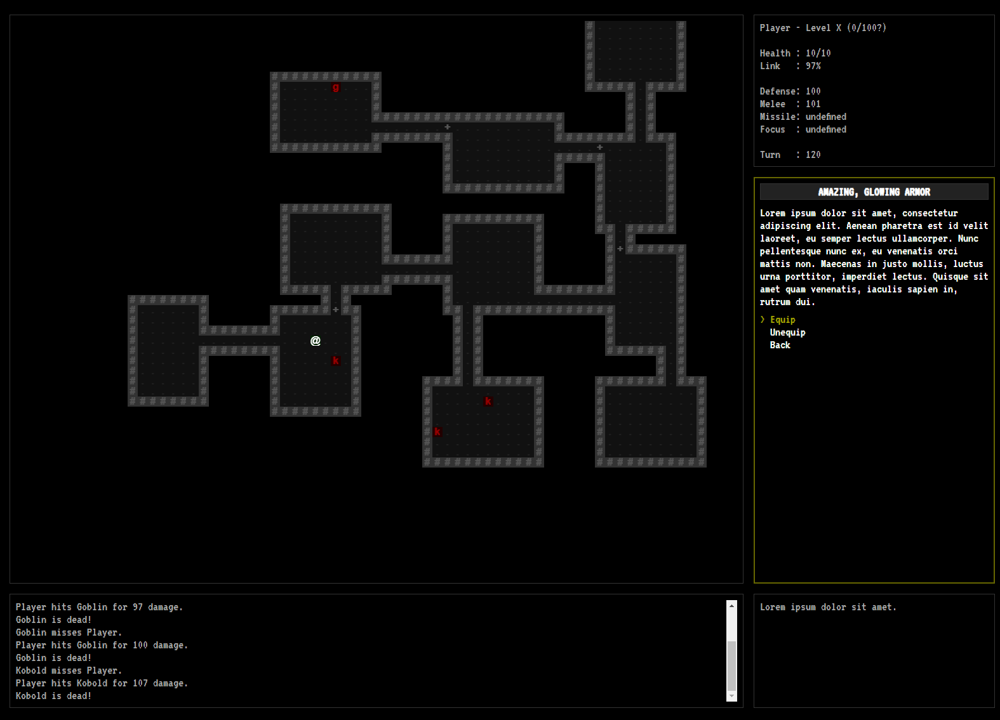

# Shift: Prelude

    Perhaps all the dragons in our lives are princesses who are only waiting to see us act, just 
    once, with beauty and courage. Perhaps everything that frightens us is, in its deepest essence,
    something helpless that wants our love.

## Overview

Shift is a hack-and-slash RPG that allows a player to search procedurally generated dungeons for adventure and treasure while uncovering a story of loss and redemption.

This is the first project in "a game a month" series I've undertaken to experiment with different game concepts.

## Design

Shift borrows the visual styling and random elements from classic Rogue-like games, but is tailored to people who do not enjoy character permadeath. The larger concept for Shift is an open-ended game that allows players to explore an ever-expanding, procedurally generated multiverse while building and customizing a character over many play sessions. In this Prelude adventure, the scope has been reduced to exploring the manifestation of a limited set of areas as they exist in different worlds.

* [Design Document](docs/design.md)

## Progress

### Iteration 1 ([v0.0.7](https://github.com/skleinjung/shift/releases/tag/v0.0.7))

* Title screen and application navigation (Exit, pause, etc.)
* Random generation of dungeons, and ability to navigate the map
* Prototype of monster behavior and movement
* Display of player status
* Display of log messages
* Expedition end conditions (player death, running out of turns)
* Basic inventory system and equipment effects
* Random roll-only combat system
