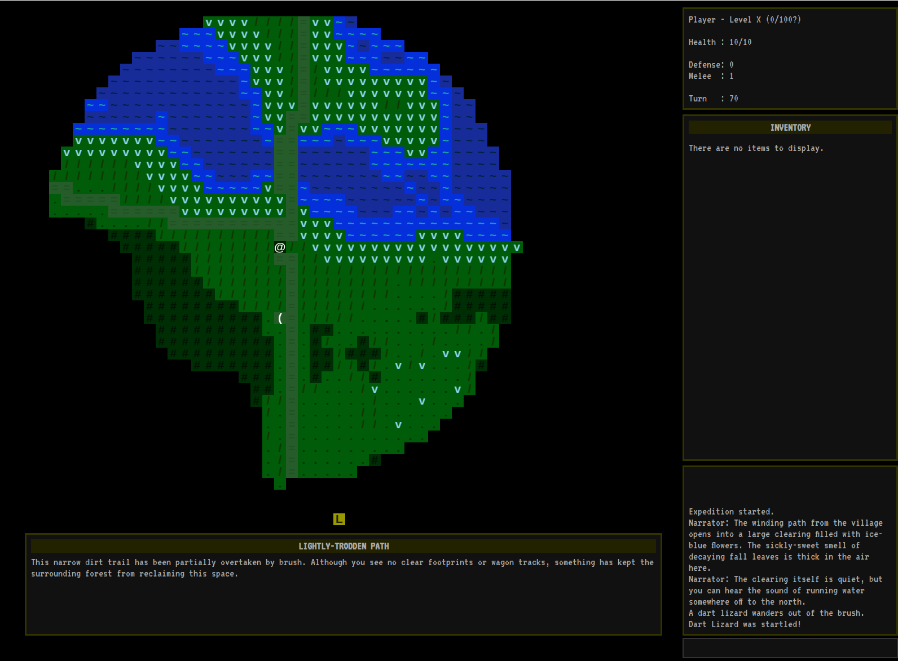

# Shift: Prelude

    Perhaps all the dragons in our lives are princesses who are only waiting to see us act, just 
    once, with beauty and courage. Perhaps everything that frightens us is, in its deepest essence,
    something helpless that wants our love.

## Overview

Shift is a snack-sized, hack-and-slash adventure that serves as an introduction to the larger world of _Shift_. In preparation for their subsequent story of loss and redemption, _Prelude_ provides an introduction to the Shifter and the wizard he works for. This introduction is made as the player helps the pair complete a spell they need to escape an enchanted forest and return safely to the wizard's tower.

This is the first project in "a game a month" series I've undertaken to experiment with different game concepts.

## Download Now Available

Shift is [available for download now](https://skleinjung.itch.io/shift-prelude-crunchless), with an optional donation to support my future work!

## Screenshots

## Design

Shift borrows the visual styling and random elements from classic Rogue-like games, but is tailored to people who do not enjoy character permadeath. The larger concept for Shift is an open-ended game that allows players to explore an ever-expanding, procedurally generated multiverse while building and customizing a character over many play sessions. In this Prelude adventure, the scope has been reduced to exploring the manifestation of a limited set of areas as they exist in different worlds.

* [Design Document](docs/design.md)

## Progress

### Iteration 4 ([v0.0.10](https://github.com/skleinjung/shift/releases/tag/v0.0.10))

This version was submitted to the [Crunchless Challenge](https://itch.io/jam/crunchless-challenge) on itch.io!

#### New Features

* Add support for multiple maps and the ability to travel between them
* Implement a basic "main quest" that can be completed to win the game
* Cleanup window appearance (remove unused menus, add correct title, etc.)

### Iteration 3 ([v0.0.9](https://github.com/skleinjung/shift/releases/tag/v0.0.9))

* Introductory narration plays when entering zones
* Added new creature types: dart lizards, river toads, thorn gremlins
* Visibility is now limited by terrain features

### Iteration 2 ([v0.0.8](https://github.com/skleinjung/shift/releases/tag/v0.0.8))

#### Items and Loot

* Dungeons can be generated with items on the ground. These items are visible on the map.
* Players can interact with items found in the dungeon (pick items up, drop items)
* When moving through the map, the message log displays a list of what items are in the current space
* When killed, monsters will drop any items they are carrying. To make this interesting, monsters can spawn with items in their inventory.

#### Monsters and Behavior

* Implemented basic path finding functionality
* It is now possible to automatically move to a destination by clicking on the map
* Monsters can intentionally move towards targets now
* New monster behaviors: chase an opponent, wander between rooms, and retaliate against aggressors

#### Gameplay Enhancements

* Turn order is now determined by an initiative system drive by the new 'speed' attribute on player and monster characters
* Added a 'flash' effect to creatures that are attacked, with the amount of damage shown as well
* Created new terrain types and symbol set for forest maps

#### UI and Quest System

* Use modal menu overlays instead of sidebar menus. (Was confusing to switch between sidebar and the map, leading testers to feel "stuck" after using the menus.)
* Create UI elements for showing narration, dialog, and quest text
* Initial support for tracking quest objectives, and triggering effects when quests are completed

### Iteration 1 ([v0.0.7](https://github.com/skleinjung/shift/releases/tag/v0.0.7))

* Title screen and application navigation (Exit, pause, etc.)
* Random generation of dungeons, and ability to navigate the map
* Prototype of monster behavior and movement
* Display of player status
* Display of log messages
* Expedition end conditions (player death, running out of turns)
* Basic inventory system and equipment effects
* Random roll-only combat system
