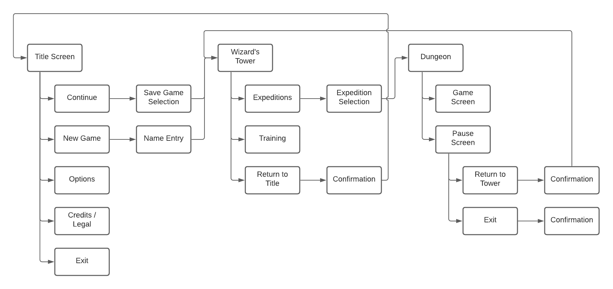
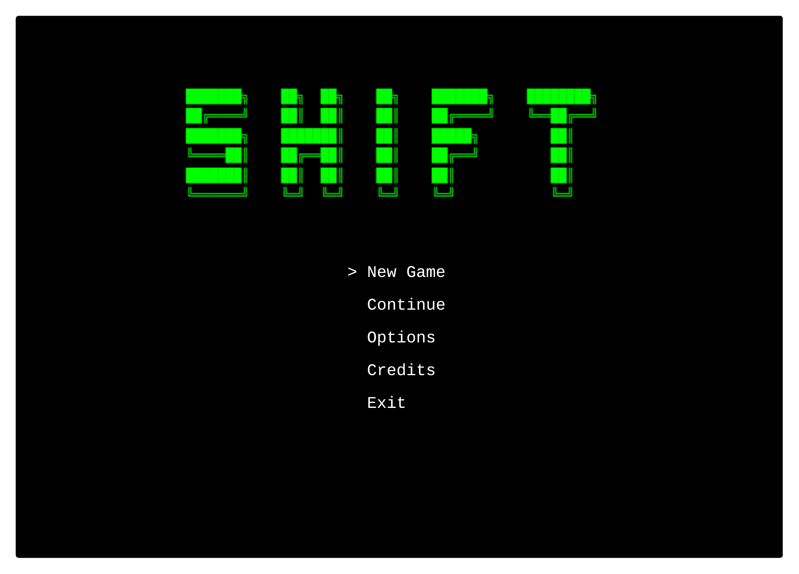
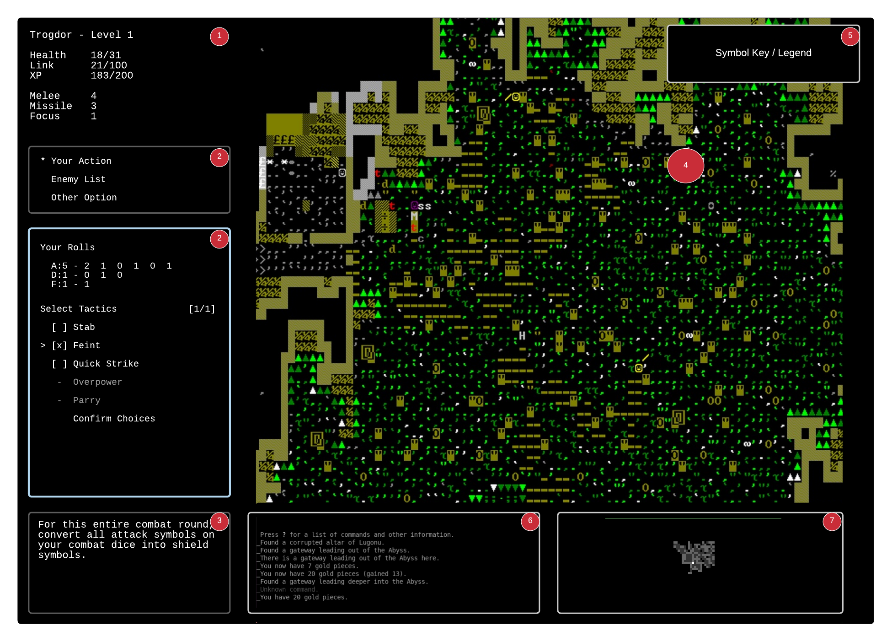
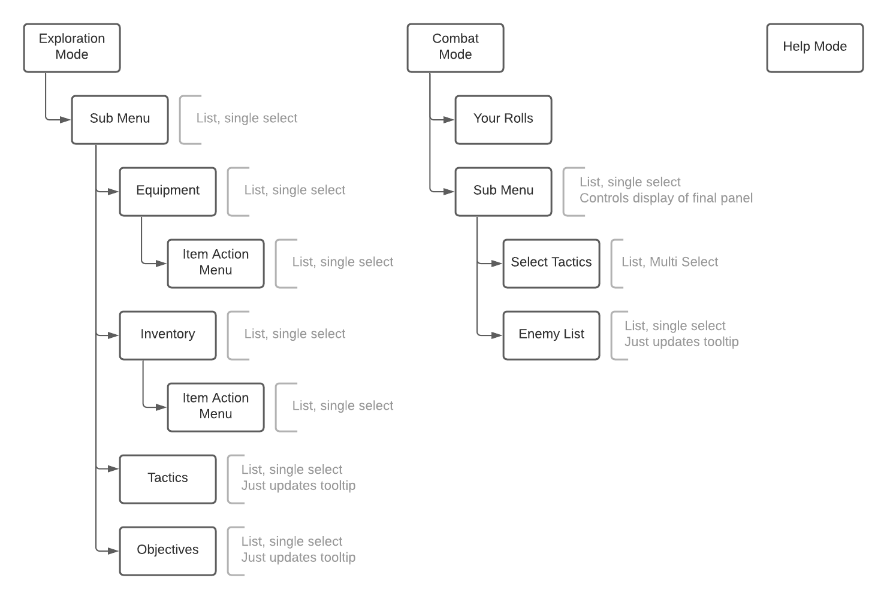
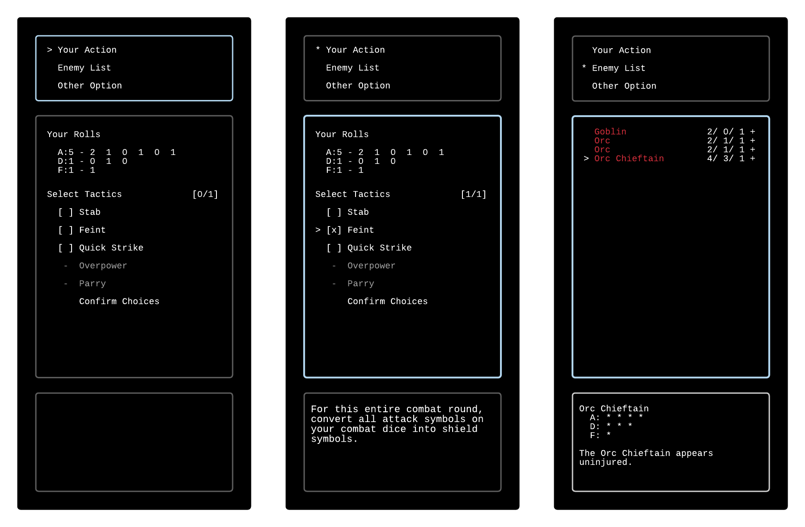

# Shift: Prelude - Design Document

Uncover a story of loss and redemption while exploring procedurally generated dungeons in this hack-and-slash RPG.

## Overview

    Perhaps all the dragons in our lives are princesses who are only waiting to see us act, just once, with beauty and
    courage. Perhaps everything that frightens us is, in its deepest essence, something helpless that wants our love.

In the world of *Shift*, powerful mages have learned to open gateways into parallel worlds, allowing chosen servants to pass between dimensions for a variety of purposes. Those individuals with the right blend of training, fortitude, and recklessness needed to undertake such a journey are known as *Shifters*. An archmage may employ a Shifter for a variety of reasons, and it's rare that a Shifter even knows the true purpose of their adventures. But, for most, the rewards of such an occupation far outweigh a little lack of understanding and the occassional moral dilemma.

Shift borrows the visual styling and random elements from classic Rogue-like games, but is tailored to people who do not enjoy character permadeath. The larger concept for Shift is an open-ended game that allows players to explore an ever-expanding, procedurally generated multiverse while building and customizing a character over many play sessions. In this Prelude adventure, the scope has been reduced to exploring the manifestation of a limited set of areas as they exist in different worlds.

*Note*: This document describes a stripped-down version of the Shift concept intended to be completed in a month, as part of the [Crunchless Challenge](https://itch.io/jam/crunchless-challenge).

### Influences

The development of Shift is influenced by ideas from the Rogue-lite, Action RPG, and hack-and-slash genres. The game will leverage tried and true mechanics from these genres and others that inspired it:

* **Procedural Dungeons**: To allow long-term replayability, dungeons and other areas will be procedurally generated.

* **RPG Elements**: Shift will allow a character to gain in power as they adventure, and the player will be able to make meaningful choices about how to enhance their character as they level up.

* **Limited Turns**: Shift aims to build a sense of urgency by limiting the number of turns a player can make while exploring. This forces the player to be planful without creating the anxiety that strict time-based limits can cause.

### Innovations

Shift aims to build upon its influences by innovating in a number of key areas:

* **Story**: The Shift universe is crafted to incorporate the randomness of procedural generation as part of its setting, rather than a purely "out of character" gameplay mechanic. The Prelude adventure is intended to tell a story of a grieving man's struggle to recover from a great loss, and will use a combination of techniques to convey this story as the adventure unfolds.

* **Combat**: Shift will improve upon the non-interactive combat found in traditional rogue-likes by allowing a player to make meaningful decisions with each attack.

## Shift will

* Provide a satisfying "levelling and looting" experience to fans of the hack-and-slash genre.

* Tell a meaningful story through a combination of subtle clues, frequent text descriptions, and occasional vignettes that reveal major plot points.

## Story

The story of *Shift: Prelude* chronicles the redemptive arc of a bitter, vengeful man struggling to cope with a great loss. As his crusade for vengeance rages on, the protagonist begins to realize that his hatred is destroying not only himself but those he claims to care for. Ultimately he is forced to confront the question of what it means to truly love another person -- especially when such love requires great sacrifice.

The protagonist of the prelude plot is the wizard employing the player character Shifter. The player character themself serves as the narrator, and is recounting the story at some future point in time.

The story will be gradually revealed as the player explores and conquers the procedural dungeons over a series of expeditions. The following mechanisms will be used to tell the story:

* The nature of the objectives for each expedition
* Static content inserted into the random dungeon, including scripted events referred to in the game's design as *vignettes*
* Interaction between the player character, his employer, and other residents of the wizard's tower
* Possibly a letter or journal entrusted to the player character (narrator) at the conclusion of the main plot

## Player Character Attributes

    The petty squabbles of this world's kings are beneath you, shifter. The unspoiled riches
    of a thousand thousand universes are your birthright.

### Core Stats

The player's character has the following attributes:

* **Health**: Health of the Shifter's avatar. The avatar is destroyed if this is depleted.
* **Link**: Strength of the connection to the world being visited. The Shifter will be pulled back to their home if this is depleted. The strength of the link dissipates over time, but can be increased by *anchoring* to key elements of the world.
* **Armor**: A measure of a character's resistance to physical damage, typically from worn armor or natural defenses.
* **Melee**: A combination of combat skill and physical attributes such as strength and speed. This attribute is used to determine effectiveness of offensive and defensive actions at close range.
* **Missile**: A combination of skill, hand-eye coordination, and reflexes. This attribute is used to determine the effectiveness of ranged attacks.
* **Focus**: A measure of concentration and tactical awareness. Focus determines how capable a character is in turning a combat situation to their advantage and dictates how effectively they employ tactics.

### Other Characteristics

* **Experience**: The player is awarded experience for achieving various goals: killing monsters, collecting treasure, and completing objectives. Experience can be used in the tower to purchase various upgrades:  
  * Improvements to core stats
  * New tactics
  * Skills, which add additional tactics to the player's combat deck
* **Inventory**: The player's inventory will contain a fixed number of slots. Each item will consume a single slot, and other factors such as weight or shape are not tracked.
* **Tactics**: A player has a pool of cards representing tactics they may employ in combat. New cards are added to the pool as the character acquires new skills or equipment. Once expended, a tactic is placed in a discard pile. Expended cards are automatically refreshed during the course of gameplay, although the exact conditions for this are still TBD.

## Combat

Combat in Shift is resolved using a combination of dice and cards. Combat dice are used to determine how favorable the combat conditions are for a character each turn, and then cards representing tactics are played to take advantage of those conditions.

### Attack and Defense Rolls

Whenever an attack is made, the attacker rolls a number of *combat dice* equal to their `melee` or `missile` attribute (whichever applies). This determines the base strength for the attack. The defender rolls a number of combat dice equal to their defense strength against the attack. The defense strength against ranged attacks is equal to the defender's `armor` attribute, and against melee attacks it is equal to the sum of their `melee` and `armor` attributes.

Combat dice are six-sided. Each face is either blank, or contains a number of 🗡️ symbols (for attack rolls) or 🛡️ symbols (for defense rolls). The number of symbols is totalled to determine the strength of the character's attack or defense.

* 🗡️ or 🛡️
* 🗡️ or 🛡️
* 🗡️🗡️ or 🛡️🛡️
* 🗡️🗡️ or 🛡️🛡️
* Blank
* Blank

### Opportunity

In addition to combat dice, attackers and defenders roll a number of *focus dice* equal to their focus attribute. The faces of these dice are either blank, or contain a number of *opportunity* symbols. The total number of such symbols rolled indicates how favorable or unfavorable the battlefield conditions are for the character this round. This *opportunity* value indicates the maximum number of tactic cards a player may play from their hand when resolving the attack.

Opportunity dice are six-sided, with the following faces (👁️ = Opportunity):

* 👁️👁️
* 👁️
* 👁️
* Blank
* Blank
* Blank

### Dealing Damage

After the attacker's and defender's dice have been rolled and the effects of all tactics have been resolved, the game will calculate how much damage (if any) was dealt by the attack. To do this, the attack strength is calculated (by adding up all 🗡️ symbols). The defense strength is calculated the same way, using the defender's 🛡️ symbol total. If the attack strength is greater than the defense strength, the defender takes an amount of damage equal to the difference between the two totals.

### Tactics

A character takes advantage of opportunities in combat by employing *tactics* from a hand of cards. These tactic cards grant bonuses (such as offensive or defensive power) to an attack action. The following types of tactics exist:

* **Attack I, II, or III**: This directly increases the effectiveness of an attack action.
* **Defense I, II, or III**: This directly decreases the effectiveness of an opponent's attack action.
* **Quick Strike**: Allows a character's attack to resolve before any combatants *not* employing a Quick Strike tactic.
* **Overpower**: Ignore the opponent's defense power for this attack.

### Equipment

A primary source of tactics is the equipment a character is using, with the specific blend of tactics provided by items giving them a unique feel. The following list shows some examples of the types of items that might exist:

* *Dagger*: Attack I (x4); Quick Strike (x1)
* *Longsword*: Attack II (x4);
* *Greataxe*: Attack III (x2); Overpower (x1)
* *Boots of Speed*: Defense I (x2); Quick Strike (x1)
* *Full Plate*: Defense III (x3)

## Game Screens

The game has three primary screens:

* **Title Screen**: The game's entry point, provides a menu with options for creating a new game, resuming an existing game, configuring the game's settings, and so on.
* **Wizard's Tower**: This is the "safe place" the player visits between expeditions. It provides a menu for selecting an expedition to begin, and a screen for purchasing upgrades with earned experience.
* **Dungeon**: The dungeon see is where the bulk of the gameplay happens, and provides the interface for exploring the world and engaging in combat.

A visual depiction of these scenes follows:

### Title Screen

A mockup of the title screen is shown below.

### Wizard's Tower Screen

TBD

### Dungeon Screen

A mockup of an example game screen while in a dungeon is shown in the following image. The numbered items are described in the following sections.

1. **Character Status**: Display of basic character attributes.
2. **Control Panels**: These panels fill the center portion of the sidebar, and -- other than moving on the map -- provide the primary mechanism with which the player interacts with the game. See the *Control Panels* section, below, for more details.
3. **Contextual Help**: Context sensitive help text or tooltip content.
4. **Map**: The largest portion of the UI shows the game map, including positions of the player, monsters, and treasures.
5. **Map Key**: Legend showing the meaning of the 'n' most important symbols currently on the map.
6. **Message Window**: The message window shows the actions taken by the player and monsters. It also shows events that have happened in the dungeon, things the player notices, or any other textual information.
7. **Minimap** Zoomed out view of the map allowing the player to get an overall sense of what has been explored.

## Control Panels

The following diagram depicts the navigation structure for the game's control panels:

### Exploration Mode

TBD

### Combat Mode

An initial mockup of the combat mode control panels is shown below.

## Project Goals

In addition to completing a game, the goal for the November Crunchles challenge is to prototype the following systems for use in future projects:

* Procedural map generation engine
* Rendering and control of a character in 2D space
* Combat system

## Project Non-Goals

The following items are out of scope for the Prelude release:

* Open world exploration
* City building, farming, etc.
* Magic
* Card-based combat "maneuvers"
