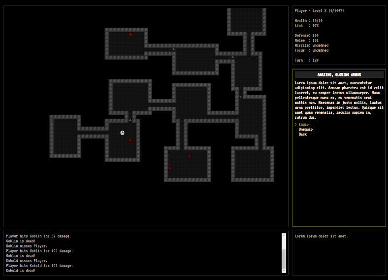

---
---

# Thrashplay

Thrashplay is [Sean Kleinjung](https://github.com/skleinjung/), when he is making games. This site is the 'mask-off', behind-the-scenes look at projects that are incubating, in development, or just plain in trouble! Raw, playable demos of prototypes and the observations and experiences of a hobbyist indie game developer are to be found here. We reserve the right to save the marketing glitz for [another place](https://store.steampowered.com/).

## Shift: Prelude

Thrashplay is currently focused on the recently-launched "game a month" series, and the first project of that event&mdash;*Shift: Prelude*. Shift is a hack-and-slash RPG that allows a player to search procedurally generated dungeons for adventure and treasure while uncovering a story of loss and redemption. You are invited to [enter the worlds of Shift](./shift) on the dedicated project page.

