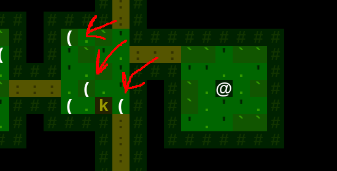
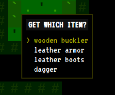
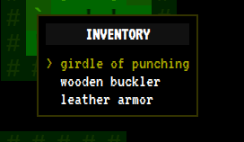
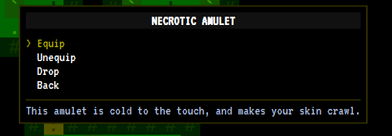
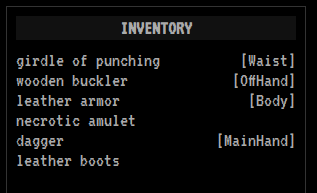

# Development Log 2: Items and Loot

* [Return to the main Shift page](../index.md)

Week two of development on Shift brought a whole lot of new features, which will be highlighted in the next few development logs. The first of these is (*drumroll*): Loot! So without further delay, let's get to the (literal) goodies.

## On the Map

It's hard to have a "levelling and looting" game with no loot, which is why I got items into Shift early on in the project. Items have a chance to spawn as treasure when building a dungeon, and&mdash;of course&mdash; monsters will drop their loot when killed. All items on the ground are visible on the map (currently as a '(' symbol):

*Look at all this loot for the taking, if you just kill that pesky kobold guarding it...*

## Interacting with Items

"Menus" aren't always the most exciting feature, until they are missing. Shift gained a couple this week&mdash; pick an item from a pile on the ground, pick an item in your inventory, and select an action to perform on a specific item:

  

*I'm sure nothing bad will happen if you put that amulet on...*

## Effects of Equipment

Since the number of systems in the game is pretty small at this point, there's not a whole lot for items to do yet. However, the system for "equippable" items is in place, and the items currently in the game *do* affect your primary attributes ("health", "melee", and "defense") in a sesnsible way. There is no "paperdoll" in this version, but the inventory list does indicate whether an item is equipped or not:

## Developer Note

> The [original design intent](https://raw.githubusercontent.com/skleinjung/shift/main/docs/images/control-panel-structure.png){:target="_blank"} was to use sidebar menus ([like this)](../../assets/shift/week_two/sidebar-menu.png){:target="_blank"} for interacting with items and the inventory. However, in playtesting, it was clunky having to change the focus between "the map" and "the menus". I tried a variety of ways of highlighting which panel was active, but it was frequently frustrating trying to move your character and finding yourself "stuck" in a menu until clicking or hitting tab to get out.
>
> I also tried using two entirely different sets of keys&mdash;one for moving on the map, and one for navigating menus. This avoided the confusion about active window, but was probably even more frustrating to remember which version of "key to move down" was going to do what I wanted. In the end, sticking to a single set of keys but using a popup menu seemed to work the best. The popup, since it displays over the map, clearly takes precedence when active. And it's pretty natural to hit *Escape* to close any open menu and get back to the game.

## More to Come

Future updates will highlight more of the [features that are already in the game](https://github.com/skleinjung/shift/releases/tag/v0.0.8), so [check me out on Twitter](https://twitter.com/thrashplay/) if you want to get updates as they are posted.

* [Return to the main Shift page](../index.md)
