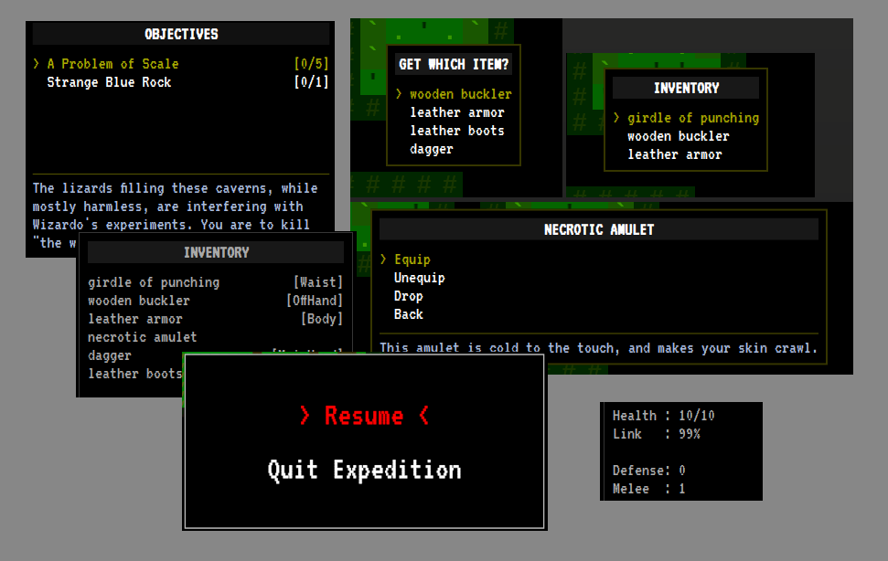
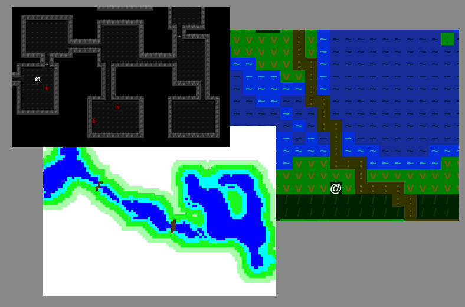
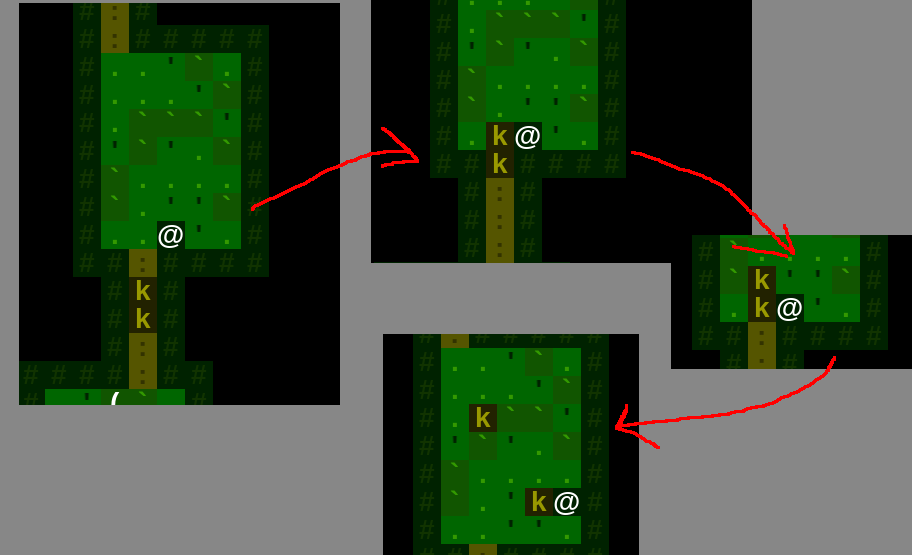

# Development Log 3: A Shift in Focus

* [Return to the main Shift page](../index.md)

This past weekend marked the start of week three of the Crunchless Challenge. When planning the tasks for the week, it became clear that a lot of the ideas I have for Shift are not achievable within the time constraints of a single month. The challenge facing me now, then, is... using what has been built so far, how can I get the Prelude project to the point of being a full-fledged game (if even a short one)?

## What do I have to work with?

In order to figure out what I can finish in two weeks, I started by looking at what I've built so far:

### UI Components

I've developed a fair number of UI components for parts of the game, such as displaying character stats, quest tracking, inventory management, and more.

### Map Generation

I have the ability to randomly generate dungeon maps. These maps are pretty bad, to be honest, but can serve as the basis for a simple game to launch this month. In addition,I can create specially crafted images in order to build static parts of a map, if I need something specific that can't be randomly built. I've also selected some colors and symbols that give a "good enough" idea of different terrain, at least for now.

Probably goes without saying, but in addition to just "generating" maps the game is also capable of displaying them and letting the player explore them, etc.

### Monsters

Creatures can live in the maps of Shift. And I can give them behaviors and let the player interact with them. Behaviors I have created so far allow for wandering about, aggressively attacking the player, retaliation and self-defense, and so on. If they have a destination, monsters are capable of navigating the map. (To chase the player, for example.)

Harder to show this without a video, but the image below shows an example where two kobolds were wandering. By attacking the second one, it became engaged in combat while the first one left his friend to die. (And die he did.) He dropped a wooden buckler, if you're interested.

### Combat

Honestly, combat is pretty barebones at the moment. It turns out, correctly balancing a system like the one described in my design document is **very time consuming**. Right now, there are some basic statistics and rolls under the hood but nothing too fancy. I did get a 'flashing' effect that makes it clear when a creature is being attacked, whether it hit or missed, and how effective the attack was. That was a lot better than last week, where things would sort of just randomly disappear after they were attacked enough. :D

### Items and Loot

I have a [whole post](./features-items-and-loot.md) about the recent updates to Shift's loot system, so I won't dwell on it more here.

### Quests

Shift has a rudimentary quest system, which includes UI display for tracking objectives, the ability to update progress as goals are achieved, and support for displaying messages from NPCs when quests are complete. Just don't expect rewards or anything at this point. But surely, being a hero and all, helping out is its own reward, am I right?

## So Now What?

After understanding the building blocks above, I have an updated scope for the launch at the end of November. The new goal is to weave together a polished version of the current features with an introductory narrative. My specific goals are:

* Implement a small number of quests (1-3) that showcase the game systems, provide a unique and hopefully fun gameplay experience, and don't rely *too* heavily on things that aren't really fully baked yet.
* Flesh out the setting for these quests with better map elements, descriptive text, and enough narrative content to introduce the concept of Shift and a subset of the character's from the larger story.
* Make it a "real" game by making sure all the menus work, transitions between application screens are intuitive, there is help text or tutorials where needed, etc.

If successful, people should play the finished product and say something like, "Hrm... that was pretty interesting. A bit short, though. I wonder when the next chapter comes out?" Here's hoping!

* [Return to the main Shift page](../index.md)
