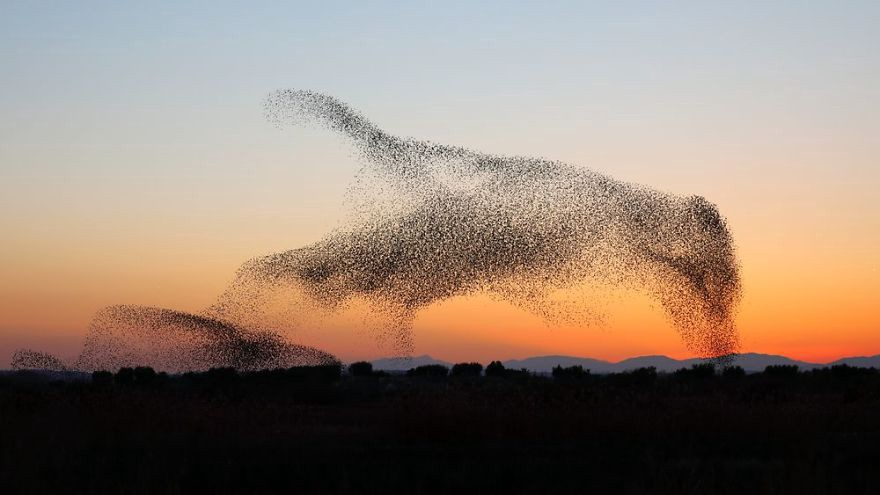

# Development Log 4: Emergent Behavior, or "Did *I* Build That?"

* [Return to the main Shift page](../index.md)

Games with procedural content such as [RimWorld](https://store.steampowered.com/app/294100/RimWorld/) and [Dwarf Fortress](http://www.bay12games.com/dwarves/)&mdash;or, naturally, rogue-likes/rogue-lites&mdash;are fascinating to me because of the stories you can embellish based on what happens in the game world. I purchased [Spelunky](https://store.steampowered.com/app/239350/Spelunky/) after seeing the trailers where they describe in the gameplay in the form of short poems. Similarly, I finally understood the point of *The Sims* franchise when I found the [Alice and Kev blog](https://aliceandkev.wordpress.com/), which tells the story of two homeless Sims as created by the game.

## Emergent Behavior

Creating a world with *emergent behavior*&mdash;where things in the game interact in ways the designer didn't full plan for&mdash;is really exciting to me. I love being surprised when playing a video game. I especially love being surprised when playing a video game *that I made*. Creating this sort of surprise is one of my main game design goals.

While working on *Shift: Prelude* this week, I experienced a tiny glimpse of this. I added two new monster types recently&mdash;a strong and territorial creature that guards treasure near its home, and a skittish creature that is easily startled and flees from danger. It was really cool watching these creatures interact... the skittish one fleeing from me, and then realizing it was heading straight towards something even more dangerous. The territorial monster chasing pests out of its home, and doing the work of killing my prey for me if it didn't escape in time. Fun stuff.

## Developer Note

> One of the easiest ways I've found to encourage the parts of the world to interact with each other in more dynamic ways is *don't treat the player like a special snowflake*. Ideally, the "player" or "hero" is just a plain creature, like every monster in the game. The only difference is their "AI" is direct control by the player instead of programmed behavior. The fewer exceptions you make for how the world interacts with the player, the more naturally monsters and items can interact with players and other entities in a consistent way.

* [Return to the main Shift page](../index.md)