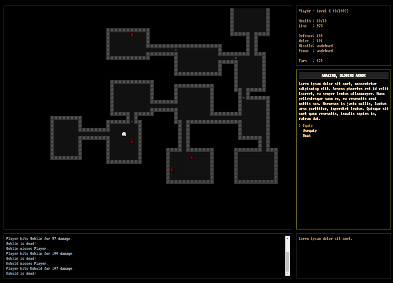

---
---

# Shift: Prelude

> "Perhaps all the dragons in our lives are princesses who are only waiting to see us act, just  once, with beauty and courage. Perhaps everything that frightens us is, in its deepest essence something helpless that wants our love."
>
> Rainer Maria Rilke

---

*Shift: Prelude* is a hack-and-slash RPG that allows a player to explore dungeons in search of adventure and treasure while uncovering a story of loss and redemption.

Shift is a Thrashplay game developed by me, [Sean Kleinjung](https://github.com/skleinjung/). It is being developed for the [Crunchless Challenge on itch.io](https://itch.io/jam/crunchless-challenge), and so&mdash;if all goes well&mdash;it will be formally published and available for download in December!

## Gameplay

In Shift, you will step into the role of a "Shifter" -- a mercenary that travels between parallel worlds to complete tasks for a powerful wizard. Although it's unlikely your employer will ever share *their* motives for these expeditions, yours are quite clear&mdash;collect the riches of other worlds, and bring them back to your own.

Players will explore dungeons and kill monsters in order to collect treasure and complete quests. It is my hope to provide a pure "levelling and looting" experience that will be familiar to fans of the genre, but with unique elements that make the world of Shift feel fresh.

Shift features retro ASCII graphics and procedurally generated content. It abandons permadeath from the rogue-likes that inspired it in favor of an emphasis on a narrative that incorporates and explains the presence of seemingly infinite random dungeons. The story of Shift unfolds over a large number of "runs", although each dungeon can only be visited a single time. Failure&mdash;while not fatal to the player's character&mdash;will still be costly by drastically changing the fate of the Shifter and their employer.

## Development Log

### Introduction

Our [development log's introductory post](./devlog/introduction) explores the project's motivation, planned gameplay elements for the December release, and the technologies that are being used.

[> Read More...](./devlog/introduction)
